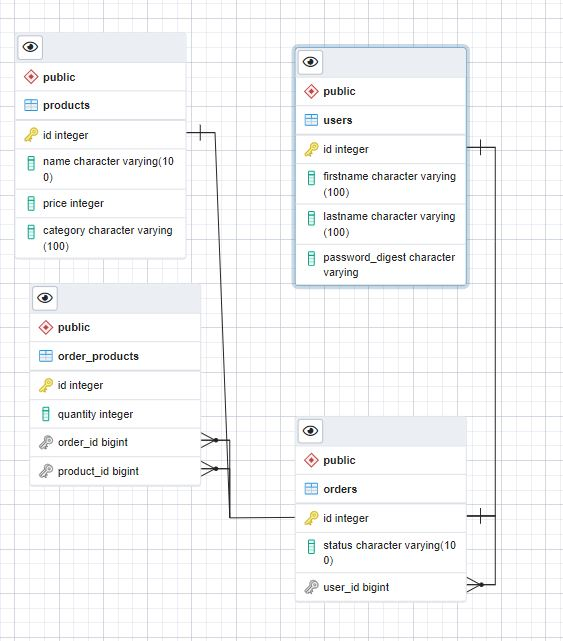

# API Requirements
The company stakeholders want to create an online storefront to showcase their great product ideas. Users need to be able to browse an index of all products, see the specifics of a single product, and add products to an order that they can view in a cart page. You have been tasked with building the API that will support this application, and your coworker is building the frontend.

These are the notes from a meeting with the frontend developer that describe what endpoints the API needs to supply, as well as data shapes the frontend and backend have agreed meet the requirements of the application. 
## Table of Contents

- [API Endpoints](#API-Endpoints)
 
- [PostgreSQL Database Schema](###PostgreSQL-Database-Schema)
 
## API Endpoints

| Endpoint | Request | Parameters | Requires Token | Usage          |
| -------- | ------- | ---------- | -------------- | -------------- |
| **/**    | **GET** | **N/A**    | **False**   | **Root Route** |
| **/api/v1/**    | **GET** | **N/A**    | **False**    | **APIs Root Route** |

#### User:

| Endpoint         | Request    | Parameters                            | Requires Token | Usage               |
| ---------------- | ---------- | ------------------------------------- | -------------- | ------------------- |
| **/user**       | **GET**    | **N/A**                               | **True** \*    | **List Users**      |
| **/user/:id**   | **GET**    | **id**                                | **True** \*    | **Show user by Id** |
| **/user**       | **POST**   | **firstname, lastname, password**     | **False**      | **Create User**     |
| **/user**       | **PUT**    | **id, firstname, lastname, password** | **True** \*    | **Update User**     |
| **/user**       | **DELETE** | **id**                                | **True** \*    | **Delete User**     |
| **/use/login** | **POST**   | **firstname, lastname, password**     | **False**      | **Logs user in**    |

#### Product:

| Endpoint          | Request    | Parameters                    | Requires Token | Usage                  |
| ----------------- | ---------- | ----------------------------- | -------------- | ---------------------- |
| **/product**     | **GET**    | **N/A**                       | **False**      | **List products**      |
| **/product/:id** | **GET**    | **id**                        | **False**      | **Show product by Id** |
| **/product**     | **POST**   | **name, price, category**     | **True** \*    | **Create product**     |
| **/product**     | **PUT**    | **id, name, price, category** | **True** \*    | **Update product**     |
| **/product**     | **DELETE** | **id**                        | **True** \*    | **Delete product**     |

#### Order:

| Endpoint                 | Request    | Parameters                   | Requires Token | Usage                    |
| ------------------------ | ---------- | ---------------------------- | -------------- | ------------------------ |
| **/order**              | **GET**    | **N/A**                      | **False**      | **List orders**          |
| **/order/:id**          | **GET**    | **id**                       | **False**      | **Load order by Id**     |
| **/order**              | **POST**   | **status, user_id**          | **True** \*    | **Create order**         |
| **/order**              | **PUT**    | **id, status, user_id**      | **True** \*    | **Update order**         |
| **/order**              | **DELETE** | **id**                       | **True** \*    | **Delete order**         |
| **/order/:id/products** | **POST**   | **id, product_id, quantity** | **True** \*    | **Add product to order** |

#### \* You will receive the token once you create a new user account or log in.

## PostgreSQL Database Schema

  

#### Products

 | Field        | Type             | Special Attributes |
| ------------ | ---------------- | ------------------ |
| **id**       | **SERIAL**       | **PRIMARY KEY**    |
| **name**     | **VARCHAR(100)** | **NOT NULL**       |
| **price**    | **INTEGER**      | **NOT NULL**       |
| **category** | **VARCHAR(100)** | **N/A**            |

#### Users
 
| Field               | Type             | Special Attributes |
| ------------------- | ---------------- | ------------------ |
| **id**              | **SERIAL**       | **PRIMARY KEY**    |
| **firstname**       | **VARCHAR(100)** | **N/A**            |
| **lastname**        | **VARCHAR(100)** | **N/A**            |
| **password_digest** | **VARCHAR**      | **N/A**            |

#### Orders

| Field       | Type             | Special Attributes |
| ----------- | ---------------- | ------------------ |
| **id**      | **SERIAL**       | **PRIMARY KEY**     |
| **status**  | **VARCHAR(100)** | **N/A**            |
| **user_id** | **VARCHAR(100)** | **FOREIGN KEY**    |

#### Order_Products

| Field          | Type             | Special Attributes |
| -------------- | ---------------- | ------------------ |
| **id**         | **SERIAL**       | **PRIMARY KEY**     |
| **quantity**   | **INTEGER**      | **N/A**            |
| **order_id**   | **VARCHAR(100)** | **FOREIGN KEY**    |
| **product_id** | **VARCHAR(100)** | **FOREIGN KEY**    |
